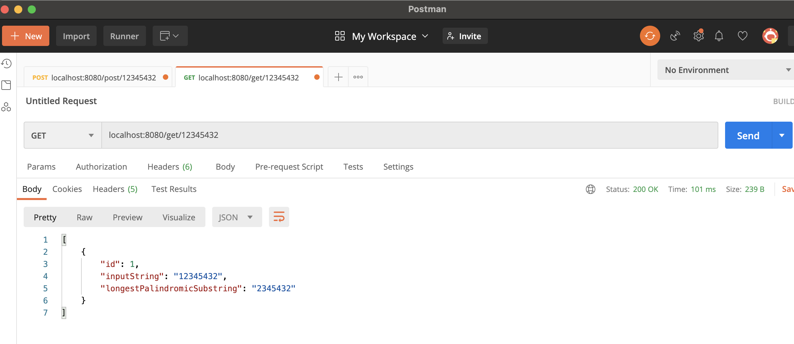
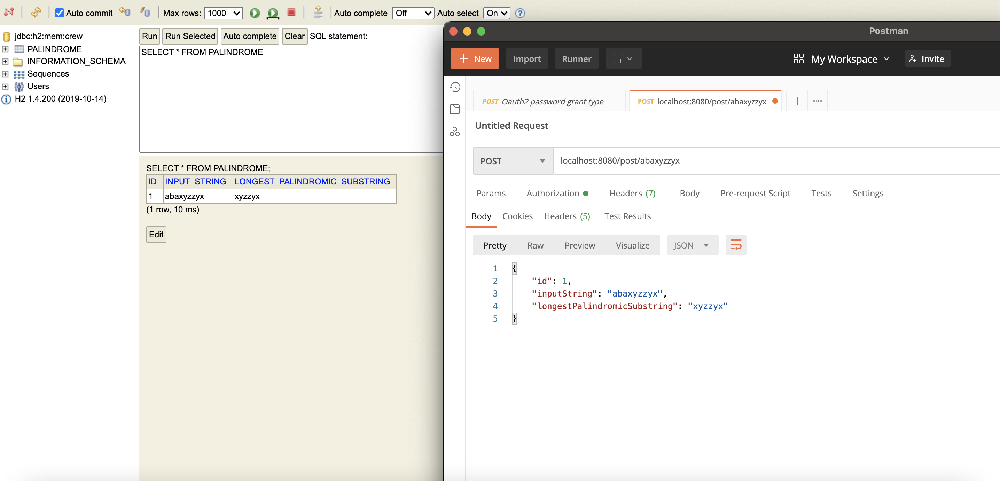
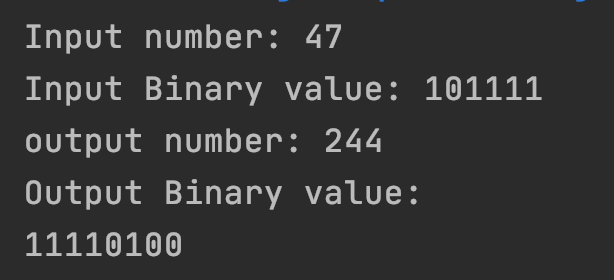

# Github-Screening-Questions

## Problem 1  
### Environment: Java 8 + h2-database + Spring Web + JPA + Lombok
  ### build:
     mvn clean install
 ### POST URL: 
    localhost:8080/get/{inputString}
 ### GET URL: 
     localhost:8080/get/{inputString}
 ### H2-database url:
    localhost:8080/h2-console
<<<<<<< HEAD
 
 

 ## Problem 2   

=======
 
 
 
 ## Problem 2   

>>>>>>> eb844b59c04fa83f6a9f8a2c9951177c9e9733ae
