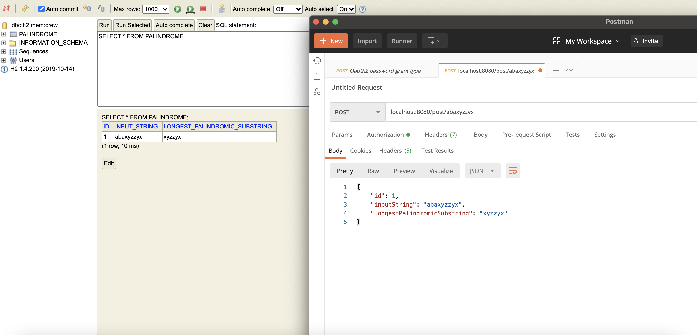
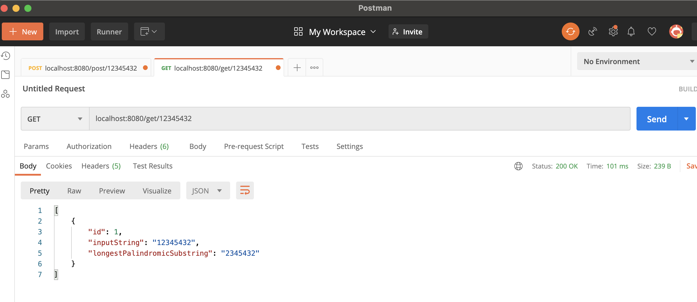

# Github-Screening-Questions

## Problem 1 :longest palindromic substring micro-service 
### Environment: Java 8 + h2-database + Spring Web + JPA + Lombok
  ### build:
     mvn clean install
 ### POST URL: 
    localhost:8080/get/{inputString}
 ### GET URL: 
     localhost:8080/get/{inputString}
 ### H2-database url:
    localhost:8080/h2-console

 
 

 ## Problem 2 BinaryReversal 

